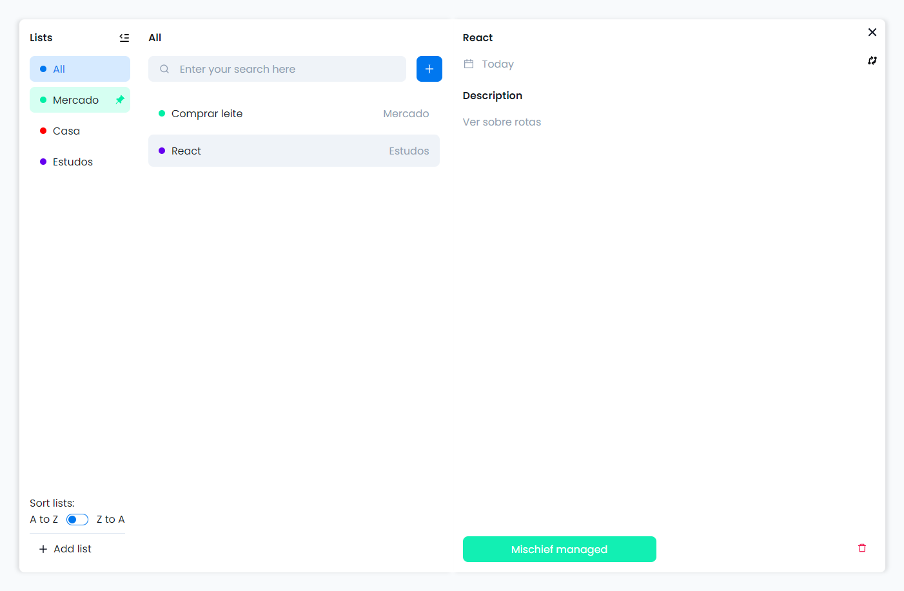

# To Do List

## Contexto

Este projeto trata-se de um To Do List para desktop, um projeto que iniciou com um Figma bem simples, e foi crescendo e expandindo nas funcionalidades.

Foi criado a partir da necessidade de estudar React de uma forma muito mais livre, sendo um dos primeiros projetos desenvolvidos a partir de uma ideia pessoal.

Com ele é possível criar listas, ordenar as listas em ascendente ou descendente, fixar e deletar as listas, criar tarefas, vincular as tarefas em novas listas, além de marcar as tarefas como feitas e deletá-las, e realizar buscas.

&nbsp;

## Tecnologias usadas

Front-end:

Desenvolvido usando: HTML5, styled-components, React, Typescript, polished, eslint, prettier

&nbsp;

## Instalando as dependências

Front-end:

yarn install

&nbsp;

## Executando a aplicação

Para rodar o Front-end:

yarn start

&nbsp;

## Link Netlify:

https://to-do-feh.netlify.app/
